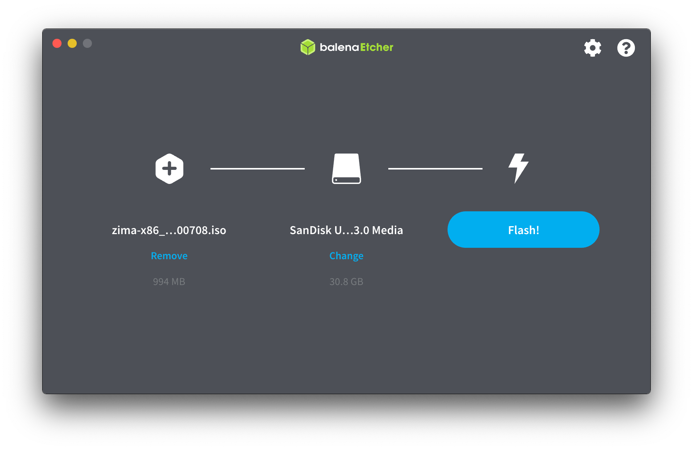
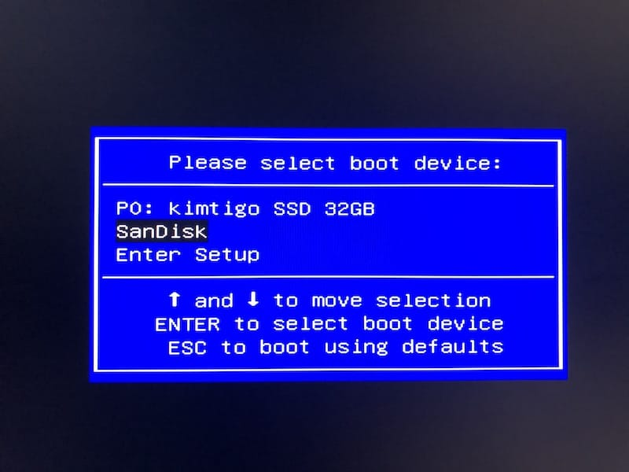
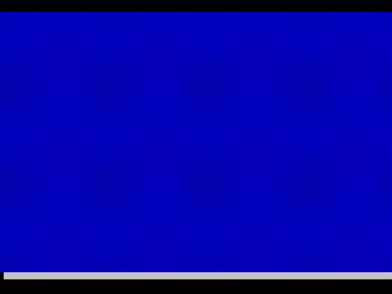
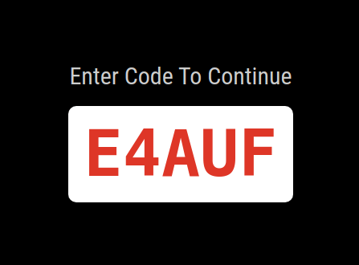
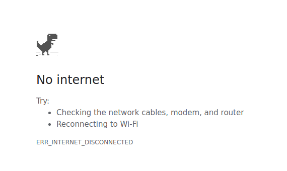

# zima-linux-docs

## Requirements

* USB drive (at least 2GB storage)
* Keyboard (USB port)

## Steps

|Step|Instruction|Image|
|----|-----------|-----|
|1   |Download ZIMA x86_64 Image (ISO) file.||
|2   |Download and install [balenaEtcher](https://www.balena.io/etcher/) on your computer. ([Windows](https://zima.oss-cn-hongkong.aliyuncs.com/images/zima/balenaEtcher-Setup-1.5.100.exe)/[Mac](https://zima.oss-cn-hongkong.aliyuncs.com/images/zima/balenaEtcher-1.5.100.dmg))||
|3   |Plug-in your USB drive (at least 2GB storage) to your computer. (The USB drive will be erased, please make sure no important files on it.)||
|4   |Open balenaEtcher, select the ISO file you just downloaded and the USB drive you just plugged-in.||
|5   |Wait until balenaEtcher finishes flashing the image file to the USB drive.||
|6   |Turn off the vending machine if it is on.||
|7   |Plug-in the USB drive and Keyboard to the vending machine.||
|8   |Turn on the vending machine and press the F11 button until you see a boot device list. Select your USB drive.||
|9   |Wait until the system is automatically installed. It takes about 10 minutes.||
|10  |The system is successfully installed if the screen shows a code (black screen) or "No internet" (white screen).| |
|11  |You can press Ctrl+D to show the desktop, to rotate the screen or configure the network.
